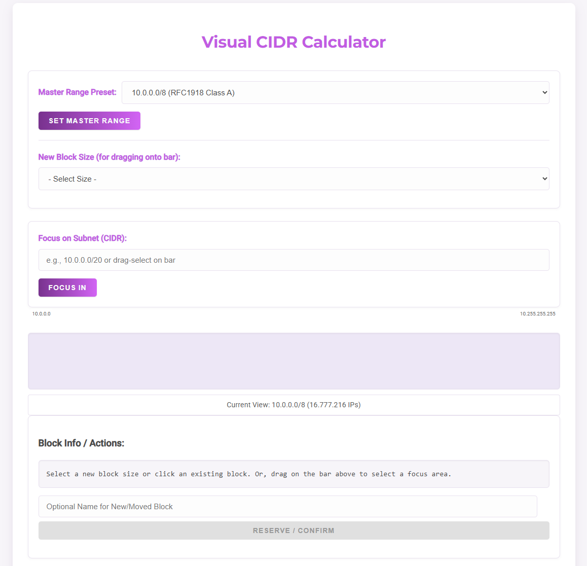
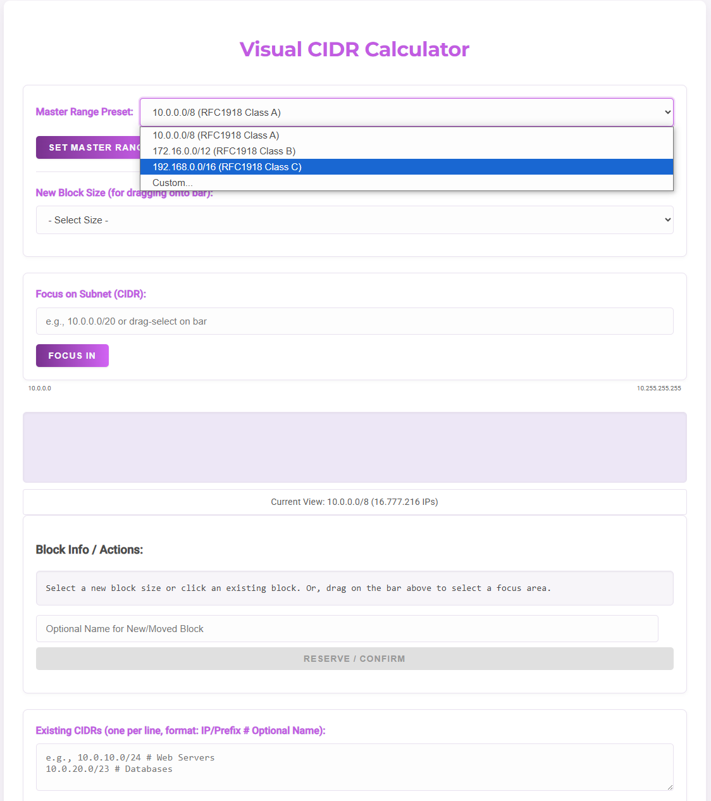
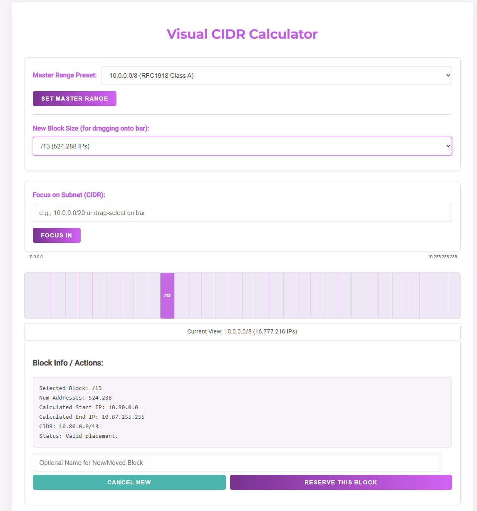
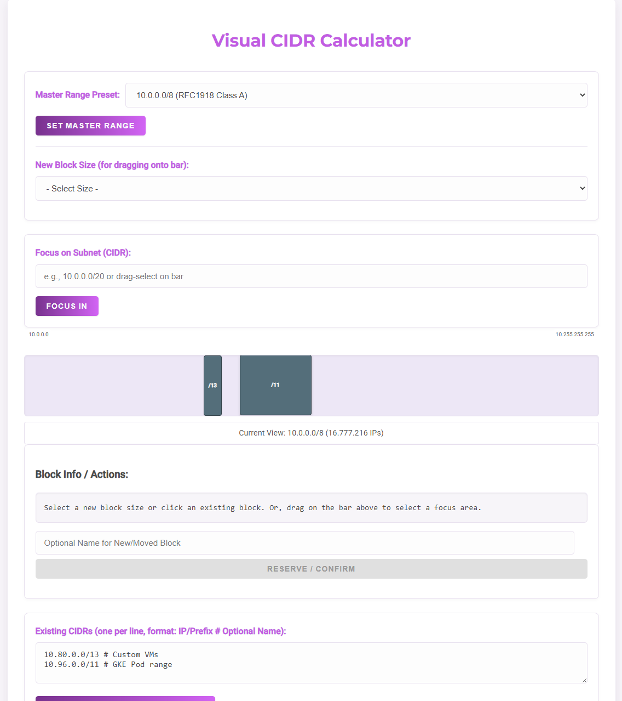
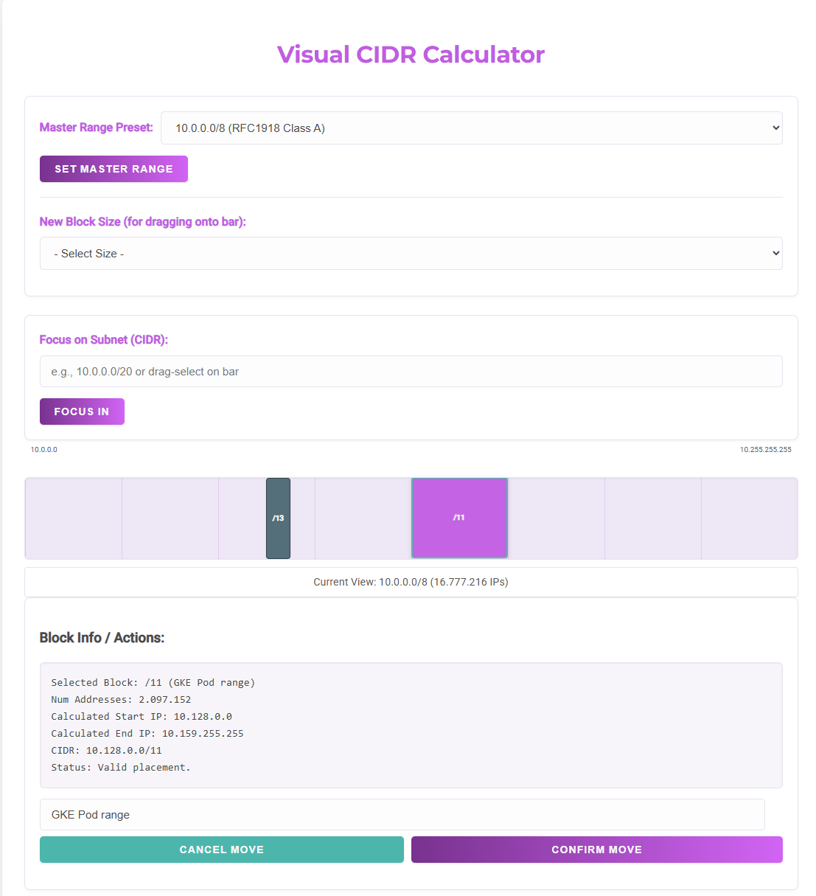
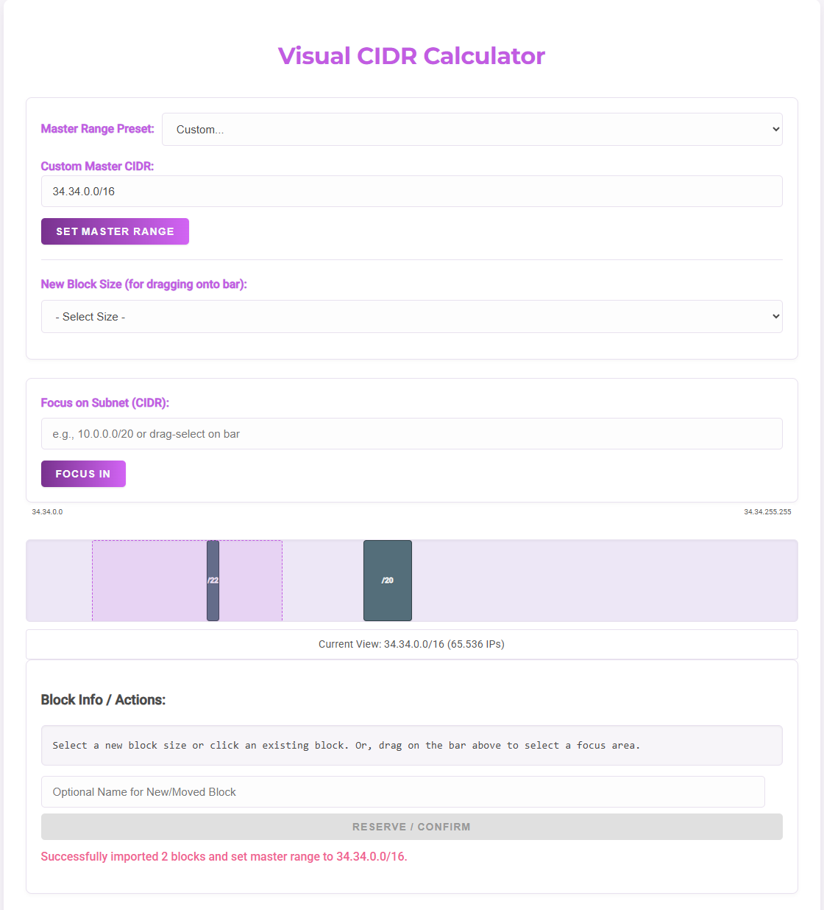
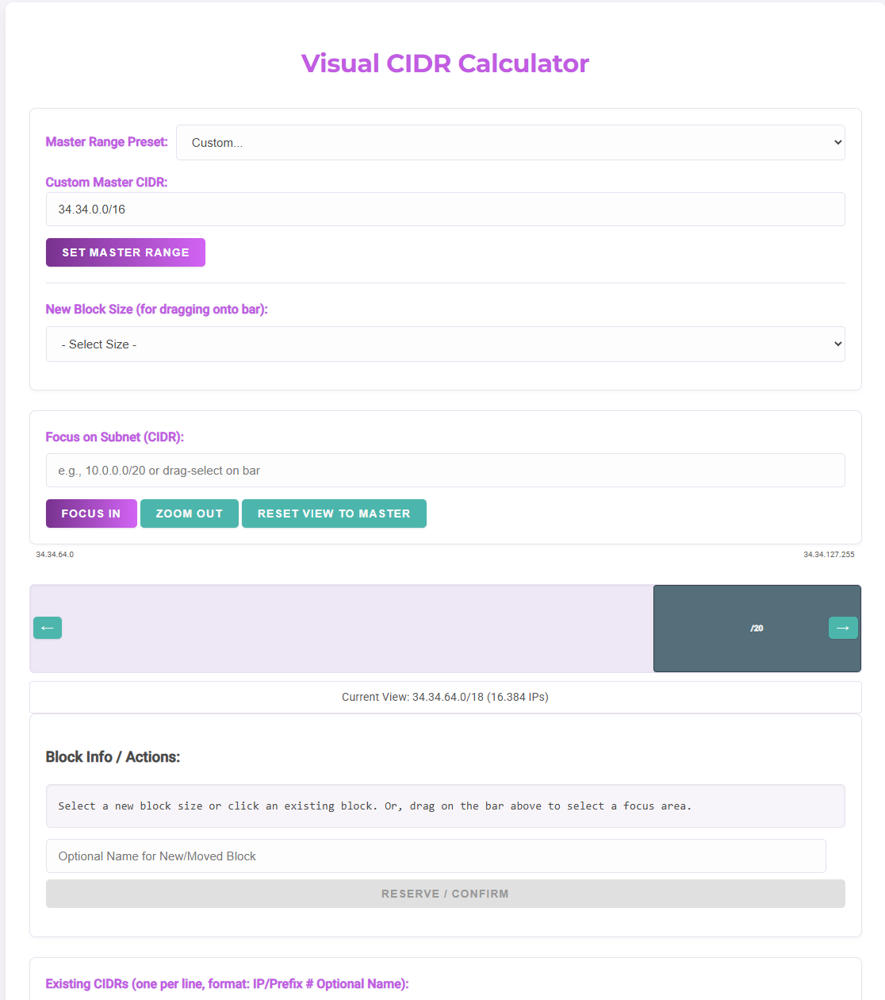
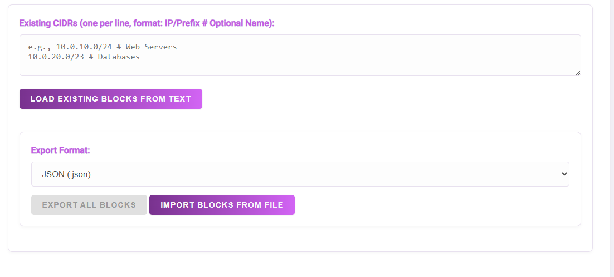

# VisualCidrCalculator
The HTML file in this repository provides a simple way to visualize the IP address space, the reservations and abilities to reserve and adjust CIDR blocks for usage in your private network. The code has been written with the support of AI tooling. There is no tracking done nor connectivity to any backend service. You can save and load your ranges from local files, following the export format in this document.

Visit the calculator at [https://xebia.github.io/VisualCidrCalculator/](https://xebia.github.io/VisualCidrCalculator/)

## Capabilities:
 - Display CIDR blocks on a predefined master range (Either class A/B/C from the RFC1918 or a custom range)
 - Placement of new CIDR blocks based on the available block size in de visualized range, including collision detection and naming
 - Detailed information about a selected block specifying the number of IP addresses in the block, start IP, end IP  and block size
 - Possibility to move existing blocks or change the name
 - Possibility to zoom and pan in the master CIDR range
 - Ability to import or export CIDR blocks from predefined output format in JSON, TXT. YAML and XML
 - Ofcourse using Xebia color scheme

## Screenshots
### Overview

### Set master range

### Block placement

### Blocks overview

### Move blocks

### Zoom to range

### Zoomed and allow panning

### Import and export

